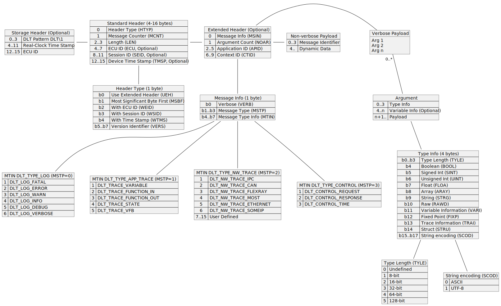
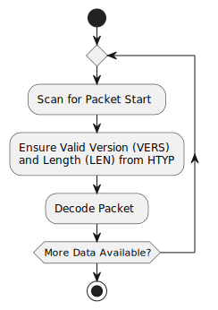
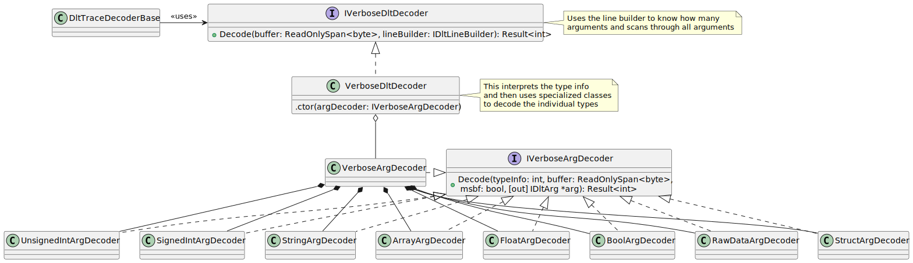
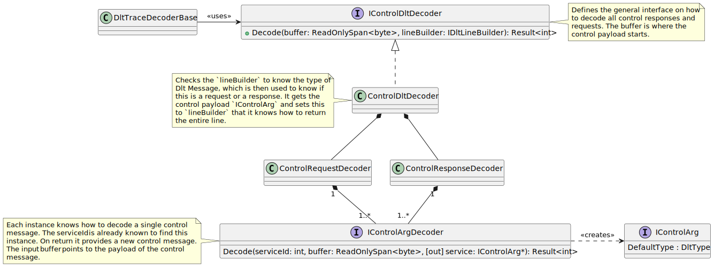
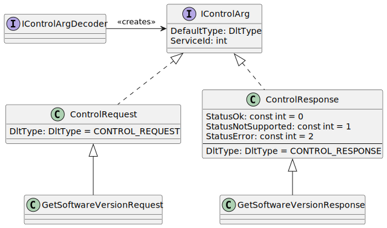
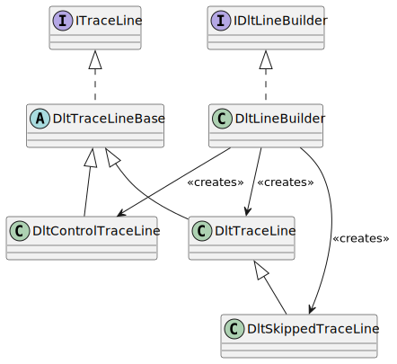

# DLT Decoder Design <!-- omit in toc -->

This document covers the design of the decoder. It derives from the [TraceReader
Architecture](../../docs/Architecture.md).

The decoder is based on the [DLT Format](DLT.Format.md).

## Table of Contents <!-- omit in toc -->

- [1. DLT Trace Decoder](#1-dlt-trace-decoder)
  - [1.1. Purpose of the DLT Trace Decoder](#11-purpose-of-the-dlt-trace-decoder)
  - [1.2. Use Cases of the DLT Trace Decoder](#12-use-cases-of-the-dlt-trace-decoder)
  - [1.3. Identifying DLT Packets](#13-identifying-dlt-packets)
    - [1.3.1. Synchronizing Headers](#131-synchronizing-headers)
  - [1.4. The Main Decode Loop](#14-the-main-decode-loop)
    - [1.4.1. Searching for the Packet Start](#141-searching-for-the-packet-start)
    - [1.4.2. Searching for the Standard Header](#142-searching-for-the-standard-header)
    - [1.4.3. Searching for the Packet](#143-searching-for-the-packet)
    - [1.4.4. Discarding Data](#144-discarding-data)
    - [1.4.5. Decoding the Packet](#145-decoding-the-packet)
      - [1.4.5.1. Non-Verbose Messages](#1451-non-verbose-messages)
      - [1.4.5.2. Verbose Messages](#1452-verbose-messages)
      - [1.4.5.3. Control Messages](#1453-control-messages)
  - [1.5. Exception Handling](#15-exception-handling)
  - [1.6. Position within the Stream](#16-position-within-the-stream)
- [2. Decoding Verbose Messages](#2-decoding-verbose-messages)
  - [2.1. Bit Structure](#21-bit-structure)
  - [2.2. Decoding Arguments](#22-decoding-arguments)
  - [2.3. Extending the Verbose Argument Decoding](#23-extending-the-verbose-argument-decoding)
  - [2.4. Supported DLT Argument Types](#24-supported-dlt-argument-types)
    - [2.4.1. Decoding String Types](#241-decoding-string-types)
    - [2.4.2. Decoding Integer Types](#242-decoding-integer-types)
  - [2.5. Unsupported DLT Argument Types](#25-unsupported-dlt-argument-types)
- [3. Decoding Control Lines](#3-decoding-control-lines)
  - [3.1. The Control Packet Structure](#31-the-control-packet-structure)
  - [3.2. Decoding with IControlDltDecoder and IControlArgDecoder](#32-decoding-with-icontroldltdecoder-and-icontrolargdecoder)
    - [3.2.1. The Control Services](#321-the-control-services)
    - [3.2.2. Constructing the DltControlTraceLine directly](#322-constructing-the-dltcontroltraceline-directly)
    - [3.2.3. Constructing the DltControlTraceLine via the DltLineBuilder](#323-constructing-the-dltcontroltraceline-via-the-dltlinebuilder)
  - [3.3. Control Services](#33-control-services)
    - [3.3.1. Variations to DLT Viewer 2.19.0 STABLE](#331-variations-to-dlt-viewer-2190-stable)
- [4. Trace Lines](#4-trace-lines)

## 1. DLT Trace Decoder

There are three trace decoders for DLT:

* TCP based streams, where a DLT packet starts with the Standard Header
* Storage files, where a DLT packet has a Storage Header describing the time
  stamp of each DLT packet when it was recorded.
* Serial based streams, which are like TCP streams, but each packet is prepended
  with the header `DLS\1`. This format is used by the Genivi DLT Viewer, but it
  is not specified by AutoSAR of itself.

### 1.1. Purpose of the DLT Trace Decoder

The DLT trace decoder is responsible for receiving parts of the byte stream and
decoding each individual DLT packet. It must look for the headers if required
(TCP streams have no fixed header structure, a valid packet can only be
determined by analysing the content). As the packet is decoded, the
`IDltLineBuilder` can then be used to construct a line.

### 1.2. Use Cases of the DLT Trace Decoder

The following use cases are considered of the trace decoder, that influences its
design:

* It shall try to be as fast as possible. Decoding packets shall be done in
  place, with copy operations only occurring as necessary (copy operations are
  needed to cache a partial line, ready for the next decode method call).
* Other decoders can be derived from this decoder. One example would be to
  calculate statistics. That means a new trace decoder, derived from
  `DltBaseTraceDecoder` and related classes, may provide its own implementation
  of `IDltLineBuilder` that returns a different object type than `DltTraceLine`
  (not shown in the diagram above, but constructed by the `DltLineBuilder`).
* It may be possible to inject functionality into the `DltBaseTraceDecoder`.
  These are called "filters", which are similar to plugins. The filter may parse
  the contents of the line, write the packet to a new stream, insert or modify
  data. It may take a raw packet and decode it based on a new format such as:
  * Decode file uploads within the DLT file;
  * Decode data streams, such as IPC and byte data;
  * etc.
* Support DLT encapsulated in other protocols, such as PCAP.
* Make it easy to write an encoder later. This impacts the design of the
  `DltTraceLine`.

### 1.3. Identifying DLT Packets

The packet structure is generally described in the diagram:

DLT streams sent over the network, known as TCP streams (but may also be part of
UDP packets) consist of the standard header which define the length of the
packet and the remaining data. There is no marker associated with the standard
header. A valid packet can only be detected by parsing the entire packet and
using heuristics (for example, assuming that the headers and the sum of all
arguments match the overall packet size). The DLT protocol implicitly makes the
assumption that data is not lost.

Packets that are stored on disk, usually recorded by a logger, consist
additionally of a storage header, which contains a searchable field `DLT\1`
followed by the standard header.

Packets that are received via unreliable streams, such as the serial port, may
be sent with a marker before each standard header, that can help synchronize in
case of data loss in the stream.

#### 1.3.1. Synchronizing Headers

The raw format assumes there is no data loss. This is generally incorrect, and
is observed that DLT streams can still be corrupted requiring some heuristics to
determine the start of each packet. Reasons for loss of data are:

* Incorrectly written software, which sends the DLT streams. Often buffer
  overflows in the applications that send streams lost data and then lose
  synchronicity with the stream.
* The transport may lose packets. TCP generally doesn't, but there is no such
  guarantee for UDP streams.
* The AutoSAR standard doesn't specify the transport, which may also be the
  UART, which is known to lose (or insert) individual bytes within the stream.

As such, when synchronizing with standard streams, the assumptions are:

* The packet is first assumed to be correct. The length field is obtained, which
  is an unsigned 16-bit value. Parsing can only start when enough bytes have
  been received. Should the stream be closed before all bytes are received, then
  one must start parsing, with the assumption of data corruption (e.g. there may
  be valid packets).
* In practice, the length of the DLT packet should be the same as the length of
  the headers and the arguments as part of the payload.
  * For verbose messages, this means implementing the specification to parse all
    argument types;
  * For non-verbose messages, this means having a valid file (usually a Fibex
    file) that additionally describes the dynamic data which is part of the
    payload.
* One can only know the length of the payload, if the payload is known. If an
  unknown control message, or an unknown argument type is provided, then the
  length of an argument is unknown and heuristics cannot be applied. By
  extension, if the message is non-verbose, the length of the data is unknown if
  no Fibex file, or the wrong Fibex file is provided. Thus checks for
  non-verbose generally should not be made, and an assumption of no data loss is
  required.

Otherwise, for files with a marker, such as those stored on disk, or with a
serial marker, one only needs to search for the next marker after each message.
Parsing the packet data should still apply heuristics, as there are still some
types of data corruption that could cause a significant amount of data to be
lost otherwise. For example, if one byte is lost so that the packet length is
significantly changed (so that the packet being parsed now appears much larger
due to data loss than what it is in reality), the heuristics applied can recover
up to 64kB of data in this case of error, instead of discarding it.

### 1.4. The Main Decode Loop

The `ITraceDecoder.Decode` method can accept any amount of data, and any data
that it doesn't "consume" must be internally cached. This internal cache should
be the maximum size of a DLT packet, which is 64kB plus the storage header of 16
bytes.

The diagram above is very simplified, and contains no caching or optimizations
for brevity.

#### 1.4.1. Searching for the Packet Start

If when entering the `Decode` method the start of the packet start should be
scanned. This depends on the header:

* *TCP*: There is no header. Thus, no scanning is required, we have to assume
  that we're at the start of the packet.
* *Storage Header*: Scan for `DLT\1` to identify the start of the packet.
* *Serial Header*: Scan for `DLS\1` to identify the start of the packet.

If there is no cached data, then simply scan from the input buffer.

If there is already cached data, scanning is being done because data was
previously discarded. Then scanning must be done of the cached data, until the
start of the packet is identified. If the packet is not identified, then the
input buffer must be scanned further (taking care that the start of the packet
may be split between the two buffers).

#### 1.4.2. Searching for the Standard Header

The standard header has an offset in the frame, depending on the format:

* *TCP*: It is at the start, so the offset is zero
* *Storage Header*: The storage header has a fixed size of 16 bytes, including
  `DLT\1`.
* *Serial Header*: The standard header has an offset of 4 bytes, immediately
  after the `DLS\1`.

If the input has not enough data, i.e. less than the offset plus the length of
the standard header, then data should be cached. The next time the `Decode`
method is called, the check for the Standard Header should be repeated, until
there is at least enough data.

| Storage Format | Minimum Length |
| -------------- | -------------- |
| TCP            | 0 + 4 = 4      |
| Storage        | 16 + 4 = 20    |
| Serial         | 4 + 4 = 8      |

The first term is the extra header, while the constant 4 is the minimum size of
the standard header.

#### 1.4.3. Searching for the Packet

Now that the standard header minimum is available, one can read the length of
the packet and calculate the minimum length of the packet.

The minimum length is expected to be:

* 4 bytes for the standard header, to the length
* 4 bytes for the ECU ID if present (WEID)
* 4 bytes for the Session ID if present (WSID)
* 4 bytes for the Time Stamp if present (WTMS)
* 10 bytes for the extended header if present (UEH)

The length field in the packet does not include the storage header or the serial
marker.

Thus, if the length field is less than the minimum, we can conclude the packet
is not a valid DLT packet, it can be discarded (the minimum amount of data), and
the search starts again.

A second heuristic that can be performed is to ensure the VERS field is of the
correct value. Any value other than `1` is the wrong version and not a valid DLT
packet also.

#### 1.4.4. Discarding Data

The amount of data that can be discarded in case of an invalid packet being
detected depends on the protocol being scanned. There are no repeating
characters in the storage or serial header, so for these formats, it's safe to
discard 4 bytes. For the TCP stream, the minimum bytes scanned should be
discarded, which is 1 byte.

When discarding data, it is not correct to discard the cached data. The next
packet header may already be within the cache.

For this reason, it is recommended that the cache size be double the maximum
packet length. This is an optimization that prevents having to move all bytes in
the cache to the left to discard data. Instead, data can remain as it is, unless
the start after discarding the data is more than the maximum size of a single
packet.

(The cache size doesn't need to be double, it just needs to be more than a
single packet, and it must be made sure every time there's a discard, that a
shift is only done if there is less data to the right of the start than what one
single maximum packet can contain.)

Of course, if we're discarding data from the cache, but it turns out that the
cache is a subset of the input buffer, then the complete cache can be discarded
and the start to the input buffer can be reset. This makes scanning for the
start of the frame simpler.

#### 1.4.5. Decoding the Packet

Once the Standard Header has been identified, the correct number of bytes are
available, the packet can now be decoded:

* The HTYP field of the Standard Header (ECU, SEID, TMSP) if available.
* The extended header if UEH is set. The extended header is always expected to
  be present for verbose messages and control messages
* The arguments if the UEH is set.

##### 1.4.5.1. Non-Verbose Messages

If the extended header is not available, the packet is a non-verbose message.
This implementation does not contain a FIBEX decoder, so the packet is created,
but there are no arguments provided.

##### 1.4.5.2. Verbose Messages

The extended header must be available, and the VERB bit is set (the MSTP value
may not be 3). Each argument shall be parsed and added to the message.

##### 1.4.5.3. Control Messages

The extended header must be available. If the MSTP value is 3, the verbose bit
VERB is ignored. The message is assumed to be a control message, and there are
no arguments.

It has been observed that not all implementations writing DLT strictly conform
to the specification given in the AutoSAR DLT PRS standard.

### 1.5. Exception Handling

The decoder loop shall not raise exceptions when decoding. In certain cases,
raising exceptions can cause a high overhead, even if the exceptions are
handled.

.NET has the [FirstChanceException
handler](https://docs.microsoft.com/en-us/dotnet/api/system.appdomain.firstchanceexception).
Applications may register to this event for diagnostics purposes, and so will
capture internal events. For example, the
[RJCP.DLL.CrashReporter](https://github.com/jcurl/RJCP.DLL.CrashReporter) is a
library that logs exception events to help application developers debug their
software when crashing in the field.

In case of errors, the design of the decoder shall be such that a success/fail
condition is observed. Methods when parsing strings shall use the `TryParse`
methods instead of relying on exceptions when parsing.

To keep code small and lean, the initial implementation of decoding shall rely
on underlying .NET checks for `Span<byte>` boundary ranges, instead of checking
span ranges explicitly before access. If the checks introduce minor performance
impacts then these can be introduced to check boundary lengths before access.

### 1.6. Position within the Stream

It is important that the position of each decoded packet is made available with
the decoded `DltBaseTraceLine`. This will help debug corrupted packets, that a
user can easily refer to the packet with a hex-editor.

There may be a small penalty when calculating the position of the stream.

Further, when calculating the position of the stream, one cannot assume that
each call to the `Decode` method doesn't skip bytes. This can happen when
decoding encapsulated streams, such as DLT from a PCAP file, where the DLT is
encapsulated within UDP packets.

## 2. Decoding Verbose Messages

A DLT Verbose message is a DLT packet that has an extended header (defined by
the UEH bit), and is a message of type of `DLT_TYPE_LOG` (MSTP is 3). It
typically consists of one or more arguments (NOAR), and the payload information
follows immediately after the extended header. The payload is a packed sequence
of data, each defined by type information (Type Info) and the payload for the
argument.

A summary of the verbose argument is given in the following diagram:

### 2.1. Bit Structure

A summary of the bits, as copied from the AutoSAR PRS

| Variable Type | TYLE  | VARI  | FIXP  | SCOD  |
| ------------- | :---: | :---: | :---: | :---: |
| BOOL          |   X   |   O   |       |       |
| SINT          |   X   |   O   |   O   |       |
| UINT          |   X   |   O   |   O   |       |
| FLOA          |   X   |   O   |       |       |
| ARAY          |       |   O   |       |       |
| STRG          |       |   O   |       |   X   |
| RAWD          |       |   O   |       |       |
| TRAI          |       |       |       |   X   |
| STRU          |       |   O   |       |       |

* `X` - Mandatory to set
* `O` - Optional to set
* Others will be ignored

### 2.2. Decoding Arguments

Once a complete DLT packet has been obtained (as determined by the packet length
in the standard header), the payload will be interpreted sequentially as per the
number of arguments (NOAR).

The `DltTraceDecoderBase` will have a reference to a `IVerboseDltDecoder` which
will take the start of the payload and the line builder. As it parses through
the arguments, it will add them to the line builder. The number of arguments is
already provided by the line builder. Any required decoding diagnostics, such as
the position where the frame starts, is provided by the line builder.

The `IVerboseDltDecoder` takes the relevant information from the given
`lineBuilder`, such as the MSBF bit if required. It starts from the beginning of
the buffer, asking the `VerboseArgDecoder` (which is injected in via its
constructor) to decode.

The `VerboseArgDecoder` should interpret the type information, and then decode
the data using the more specialized argument decoder. The `VerboseArgDecoder`
returns the results of the more specialized decoder, such as the length of data
decoded and the argument that was decoded.

If the argument is unknown, it is no longer possible to decode the remainder
arguments, thus rendering effectively the entire packet unknown. The length
information is implicitly part of the verbose DLT argument and is not encoded in
a consistent manner across all arguments.

When the packet is completely decoded, the length of the payload by summing the
decoding of each argument, should match the expected length of the entire packet
(after taking into account the headers and previous data structures). The length
can be used as a plausibility check for the validity of the packet, to guard
against corrupted headers.

By separating the decoding between the `VerboseDltDecoder` and the
`VerboseArgDecoder`, one can use the same implementation for argument decoding
(`VerboseArgDecoder`) when trying to decode structures and arrays.

### 2.3. Extending the Verbose Argument Decoding

If the user wishes to extend the implementation, or modify or improve the
argument decoding, they should be able to provide a replacement implementation
of `VerboseArgDecoder`, injected into the `VerboseDltDecoder`. The replacement
implementation will need to decode the type information, and then decode one
argument at a time.

The output of the `VerboseArgDecoder` is then an `IDltArg` which the
`VerboseDltDecoder` adds to the line builder, and the size of the buffer that
should be advanced from the start of the argument to find the next argument.

### 2.4. Supported DLT Argument Types

Software supports these argument types and formats

| Argument Type | 8-bit | 16-bit   | 32-bit | 64-bit | 128-bit  | VARI | Notes                                        |
| ------------- | ----- | -------- | ------ | ------ | -------- | ---- | -------------------------------------------- |
| BOOL          | Yes   | -        | -      | -      | -        | No   | Size is not needed, except for deserializing |
| UINT          | Yes   | Yes      | yes    | Yes    | Unknown† | No   | 128-bit is not native to .NET                |
| SINT          | Yes   | Yes      | Yes    | Yes    | Unknown† | No   | 128-bit is not native to .NET                |
| Hex UINT      | Yes   | Yes      | Yes    | Yes    | Unknown† | No   | Same as UINT, prints as Hex                  |
| Binary UINT   | Yes   | Yes      | Yes    | Yes    | Unknown† | No   | Same as UINT, prints as binary string        |
| FIXP INT      | No    | No       | No     | No     | No       | No   | Fixed point types not represented            |
| FLOAT         | -     | Unknown† | Yes    | Yes    | Unknown† | No   |                                              |
| Raw           | -     | -        | -      | -      | -        | No   | A byte array, shown as a hex string          |
| String        | -     | -        | -      | -      | -        | No   |                                              |

* †: This argument is returned as an `UnknownDltArg`. Thus, while the argument
  cannot be represented as a native type, it is still decoded and the byte
  contents are returned.

The float formats are:

| Length  | Mantissa | Exponent | Supported | Notes                                |
| ------- | -------- | -------- | --------- | ------------------------------------ |
| 16-bit  | 10       | 5        | No        | Half floats are supported by .NET 5+ |
| 32-bit  | 23       | 8        | Yes       |                                      |
| 64-bit  | 52       | 11       | Yes       |                                      |
| 128-bit | 112      | 15       | No        | .NET doesn't support 128-bit floats  |

#### 2.4.1. Decoding String Types

Strings can be encoded using ASCII or UTF8. The implementation uses ISO-8859-15
as the coding type for interpreting ASCII data. No additional package is needed
for the ISO encoding, as this is implemented directly in the library in an
optimized way.

#### 2.4.2. Decoding Integer Types

The Genivi DLT implementation also provides coding support for binary and
hexadecimal for unsigned integer types, which is supported by this decoder
(signed integer types are not affected). The following coding bits are
supported:

| Coding (b17..b15) | Coding      |
| ----------------- | ----------- |
| 0                 | Decimal     |
| 2                 | Hexadecimal |
| 3                 | Binary      |

### 2.5. Unsupported DLT Argument Types

The following verbose types are not supported.

| Argument Type | VARI | Notes                                            |
| ------------- | ---- | ------------------------------------------------ |
| Trace Info    | -    |                                                  |
| Struct        | O    | Inner types decoded are those that are supported |
| Array         | O    | Inner types decoded are those that are supported |

To extend support for new types, provide a new implementation of
`VerboseArgDecoder`.

## 3. Decoding Control Lines

A control line can either be a control request (typically received from a device
external to the application logging) or a control response, which is a response
to a control request, or an unsolicited message (such as version information,
logging level or a timing response). The timer response is a special purpose
message implemented by the Genivi DLT Daemon, but not explicitly specified in
the AutoSAR PRS (it defines a timing message differently).

The parts of a DLT message that make up a control message are:

* The standard header includes the extended header
* The extended header has the message info field MSTP which is the value of 3
  * `1` is a control request
  * `2` is a control response
  * `3` is a time message
  * All other values are considered an error and result in a corrupted packet.
* The argument count (NOAR) in the extended header is expected to be zero and is
  ignored.
* The verbose flag (VERB) in the extended header is expected to be zero and is
  ignored.
* The payload immediately after is the control message. The contents of the
  control message are specified by the AutoSAR PRS. In use implementations do
  not implement precisely to the AutoSAR standards, and so some messages contain
  more data than is specified. In these specific cases, the data will be parsed,
  the extra data is ignored, where there are concrete examples in the field that
  warrant this (this may be due to changes in the standard, or implementations
  before the standard was ratified). Packets that are shorter, or cannot be
  decoded are considered corrupted.

The design for decoding control messages shall be extensible. A user should be
able to inherit from the decoder and add/remove their own implementations of
control message decoding. This allows extensions for non-standard ECUs,
implementation of custom message controls, or other changes over time, without
necessarily having to fork this implementation.

### 3.1. The Control Packet Structure

The general structure of a control payload is given as follows:

For each `ServiceId`, there are two data-structures: the request; and the
response. The `DLT_CONTROL_TIME` is a special case and has no payload.

### 3.2. Decoding with IControlDltDecoder and IControlArgDecoder

The DLT decode loop in `DltTraceDecoderBase` will check the `DltType` and
determine this is a control message as given above. It then calls an instance of
an object implementing `IControlDltDecoder` (e.g. the `ControlDltDecoder`).

The `IControlDltDecoder.Decode` method is given the buffer at the start of the
Control Payload which includes the service identifier. It extracts the service
identifier, and knows the type of control message from the `IDltLineBuilder`
which was decoded by the `DltTraceDecoderBase` prior, and from this it can look
up how to interpret the contents of the control payload.

To make the implementation extendable, the `ControlDltDecoder` uses two
dictionaries (`ControlRequestDecoder` and `ControlResponseDecoder`) to find the
mapping from the service identifier to the code that knows how to interpret and
construct a `IControlDltArg` message. A user can construct their own
`ControlDltDecoder`, register new mappings by registering a new
`IControlArgDecoder`, and inject this into the `DltTraceDecoderBase` themselves
with their own factory method.

On exit of the `IControlDltDecoder.Decode` method, the length of the argument
decoded as given by the `IControlArgDecoder` is returned, with the `IControlArg`
set to the provided `IDltLineBuilder`.

#### 3.2.1. The Control Services

The `IControlDltDecoder` has references to many different types of
`IControlArgDecoder` objects, each one is responsible for creating a single
control request or a control response object derived from an `IControlArg`.

The `IControlArgDecoder.Decode` method returns the length of the payload, also
including the first 4 bytes of the service identifier.

To simplify the construction of the many control argument objects, there are two
base objects: `ControlRequest` and `ControlResponse`. It's not necessary that
objects derive from these two base classes, but it makes it easier. If a class
wishes to know if an object is a request or a response, they should look at the
`IControlArg.DefaultType` property, which is copied to the
`DltControlTraceLine.Type` property, and not the runtime type of the object.

The main purpose of each `IControlArg` is to specify the service identifier, any
extra information associated with each control message and a mechanism to print
the contents of the control message with the `ToString()` method.

#### 3.2.2. Constructing the DltControlTraceLine directly

The `DltControlTraceLine` object should be given the control message in the
constructor. The `DefaultType` property will be used to automatically choose the
correct type during construction.

#### 3.2.3. Constructing the DltControlTraceLine via the DltLineBuilder

The `IControlArg` is assigned to the `IDltLineBuilder` while being decoded. The
`IDltLineBuilder` can either have a set of arguments, or a control payload. It
cannot have both as this cannot occur with the DLT protocol.

### 3.3. Control Services

The following Service Identifiers are defined (`X` is for implemented):

| Service Id            | Name                       | Request | Response | Standard  |
| --------------------- | -------------------------- | :-----: | :------: | --------- |
| `0x01`                | SetLogLevel                |    X    |    X     | PRS 1.4.0 |
| `0x02`                | SetTraceStatus             |    X    |    X     | PRS 1.4.0 |
| `0x03`                | GetLogInfo                 |         |          | PRS 1.4.0 |
| `0x04`                | GetDefaultLogLevel         |    X    |    X     | PRS 1.4.0 |
| `0x05`                | StoreConfiguration         |    X    |    X     | PRS 1.4.0 |
| `0x06`                | ResetToFactoryDefault      |         |          | PRS 1.4.0 |
| `0x0A`                | SetMessageFiltering        |         |          | PRS 1.4.0 |
| `0x11`                | SetDefaultLogLevel         |         |          | PRS 1.4.0 |
| `0x12`                | SetDefaultTraceStatus      |         |          | PRS 1.4.0 |
| `0x13`                | GetSoftwareVersion         |    X    |    X     | PRS 1.4.0 |
| `0x15`                | GetDefaultTraceStatus      |         |          | PRS 1.4.0 |
| `0x17`                | GetLogChannelNames         |         |          | PRS 1.4.0 |
| `0x1F`                | GetTraceStatus             |         |          | PRS 1.4.0 |
| `0x20`                | SetLogChannelAssignment    |         |          | PRS 1.4.0 |
| `0x21`                | SetLogChannelThreshold     |         |          | PRS 1.4.0 |
| `0x22`                | GetLogChannelThreshold     |         |          | PRS 1.4.0 |
| `0x23`                | BufferOverflowNotification |   N/A   |          | PRS 1.4.0 |
| `0xFFF`..`0xFFFFFFFF` | CallSWCInjection³          |    -    |    -     | PRS 1.4.0 |

The following are not listed in the current standard, or marked as deprecated:

| Service Id | Name                         | Request | Response | Standard  |
| ---------- | ---------------------------- | ------- | -------- | --------- |
| `0x07`     | SetComInterfaceStatus¹       |         |          | SWS 4.2.2 |
| `0x08`     | SetComInterfaceMaxBandwidth¹ |         |          | SWS 4.2.2 |
| `0x09`     | SetVerboseMode¹              |         |          | SWS 4.2.2 |
| `0x0B`     | SetTimingPackets             |         |          | SWS 4.2.2 |
| `0x0C`     | GetLocalTime¹                |         |          | SWS 4.2.2 |
| `0x0D`     | SetUseECUID¹                 |         |          | SWS 4.2.2 |
| `0x0E`     | SetUseSessionId¹             |         |          | SWS 4.2.2 |
| `0x0F`     | UseTimestamp¹                |         |          | SWS 4.2.2 |
| `0x10`     | UseExtendedHeader¹           |         |          | SWS 4.2.2 |
| `0x14`     | MessageBufferOverflow¹       |         |          | SWS 4.2.2 |
| `0x16`     | GetComInterfaceStatus¹       |         |          | SWS 4.2.2 |
| `0x17`     | GetComInterfaceNames²        |         |          | SWS 4.2.2 |
| `0x18`     | GetComInterfaceMaxBandwidth¹ |         |          | SWS 4.2.2 |
| `0x19`     | GetVerboseModeStatus¹        |         |          | SWS 4.2.2 |
| `0x1A`     | GetMessageFilteringStatus¹   |         |          | SWS 4.2.2 |
| `0x1B`     | GetUseECUID¹                 |         |          | SWS 4.2.2 |
| `0x1C`     | GetUseSessionID¹             |         |          | SWS 4.2.2 |
| `0x1D`     | GetUseTimestamp¹             |         |          | SWS 4.2.2 |
| `0x1E`     | GetUseExtendedHeader¹        |         |          | SWS 4.2.2 |

The following are observed implementations that are implemented in Genivi DLT,
but not documented in the AutoSAR PRS.

| Service Id | Name               | Request | Response | Standard |
| ---------- | ------------------ | ------- | -------- | -------- |
| `0xF01`    | Unregister Context |         |          | N/A      |
| `0xF02`    | Connection Info    |         |          | N/A      |
| `0xF04`    | Marker             |         |          | N/A      |

* ¹: This is made obsolete in PRS 1.3.0 and later
* ²: Was renamed in later version of the standard, but the message structure
  remains the same.
* ³: This will not be implemented - software will need to provide their own
  decoder.All DLT trace lines are derived from the `DltTraceLineBase`.

#### 3.3.1. Variations to DLT Viewer 2.19.0 STABLE

This section highlights some of the output differences between the request and
response objects implemented by this library compared to the Genivi DLT Viewer
2.19.0, 19th August 2019.

| Service | Type     | Genivi DLT                                 | TraceReader.DLT                                |
| ------- | -------- | ------------------------------------------ | ---------------------------------------------- |
| `0x01`  | Request  | `[set_log_level] <bytes>`                  | `[set_log_level] <level> APP1 (CTX1) COM1`     |
| `0x02`  | Request  | `[set_trace_status] <bytes>`               | `[set_trace_status] <status> APP1 (CTX1) COM1` |
| `0x04`  | Response | `[get_default_log_level <status>] <bytes>` | `[get_default_log_level <status>] <level>`     |

## 4. Trace Lines

Other trace lines may be generated as required from the decoder.

It is important to recognize here that a DLT trace line, and a DLT Control trace
line are different.

* A Control Trace Line doesn't have arguments
* A DLT Trace Line may contain arguments, either decoded from the packet data,
  or from dynamic data and an external file describing how to parse the dynamic
  data.

The `DltTraceDecoder` uses provides the data it parses to its `IDltLineBuilder`
to construct the trace line it will return later. This allows the base
implementation `DltTraceDecoderBase` to be extended to create other types of
trace lines, without having to encapsulate (wrap) or create temporary copies.
