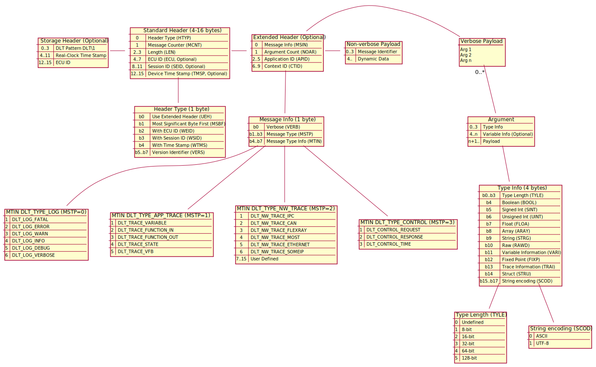

# DLT Protocol Issues <!-- omit in toc -->

The DLT format is not a well structured protocol, it does not follow the
guidelines of OSI layering. This paper tries to explain why this is a problem,
and what needs to change in the protocol (which makes it incompatible to
existing implementations).

## Table of Contents <!-- omit in toc -->

- [1. The Structure over Serial or Ethernet](#1-the-structure-over-serial-or-ethernet)
- [2. Possible Decoder Implementations](#2-possible-decoder-implementations)
  - [2.1. Assume the Length of the Packet is Correct](#21-assume-the-length-of-the-packet-is-correct)
  - [2.2. Protocol Knowledge and Parsing - The Standard Header](#22-protocol-knowledge-and-parsing---the-standard-header)
  - [2.3. Protocol Knowledge - Using More Fields](#23-protocol-knowledge---using-more-fields)
  - [2.4. Control Messages](#24-control-messages)
  - [2.5. Non-Verbose Messages](#25-non-verbose-messages)
- [3. Fixing the Protocol](#3-fixing-the-protocol)
  - [3.1. Use a Marker - Not Enough](#31-use-a-marker---not-enough)
  - [3.2. Proposed Extension - Extend with a FCS](#32-proposed-extension---extend-with-a-fcs)

## 1. The Structure over Serial or Ethernet

Take the protocol format:

Ignore the Storage Header, as this is recorded by the logging equipment and is
not transmitted by the device doing the logging, and as such, can be considered
outside of the scope of the protocol.

If it can be guaranteed that each packet is perfectly written, so that the
length of each packet is correct according to the wire, an implementation can be
optimized to assume no errors and be able to reconstruct the boundaries of each
packet.

## 2. Possible Decoder Implementations

In reality, one cannot assume that each packet is perfectly written. The
following issues are well known:

* Serial port transport, may result in bit flips, bytes lost, or occasionally
  bytes are injected (typically 0xFF or 0x00). This changes the length or the
  meaning of the content of the packet. The length of the packet is no longer
  reliable.
* Encapsulation within UDP packets may result in larger chunks of data being
  lost, up to 1400 bytes. If a fragmented UDP packet contains DLT then a large
  chunk of that data may be lost.
* Buffer handling errors in implementations when sending data may result in
  corruption of the DLT packets before the data is even sent. In this case, an
  arbitrary amount of data may be lost anywhere in the stream, even a TCP stream
  which would otherwise be considered reliable.

Due to the lack of the following in the packet description:

* there being no well defined boundaries between the packets; or
* frame checksums to test the integrity of the data being decoded

a decoder cannot reliably decode data in a stream after an error has occurred.
How it does this is completely implementation dependent.

### 2.1. Assume the Length of the Packet is Correct

A decoder may decide that the length is always correct. This is a risk, as
described above in the possible (real-world and observed) error conditions. The
likelihood after decoding of resynchronising to the data stream as intended by
the device emitting logs is very small, approximately 1 in 65526 (calculated
that most of the data in the stream is random data, and is interpreted as a
length which happens to perfectly align with a valid next packet).

We can see this is not a good solution to packet parsing as it is expected a
significant amount of data is to be lost.

### 2.2. Protocol Knowledge and Parsing - The Standard Header

The mechanism this decoder uses to improve the likelihood of synchronising with
a new packet in case of an error includes field validation. If a field is
determined as impossible, it is considered that the point in the stream which is
used to start decoding the packet is invalid, and decoding is advanced by one
byte, and is tried again.

The fields that can be used initially are:

* The DLT version is expected to be 1. If it isn't, it is assumed data
  corruption. If a new version is invented, this decoder either shouldn't be
  used, or the chances of recovery is reduced depending on how the new protocol
  version is defined (if it fixes these problems or not by defining at least a
  frame checksum or some other similar marker to determine the validity of a
  packet once it's decoded).
* The minimum length of a packet must be at least the minimum length as defined
  by the standard header, and the presence of an extended header if it should be
  present. If the packet is less than the protocol bits specify, then the packet
  is invalid.

This mechanism is a heuristic only, and is not a foolproof means of determining
that a packet is valid or not.

For example, let's assume that the first byte of this message is lost.

| Bytes         | Description                               |
| ------------- | ----------------------------------------- |
| `3d`          | Version 1, Session Id, ECU Id, Time Stamp |
| `7f`          | Counter 127                               |
| `00 28`       | Length                                    |
| `45 43 55 31` | ECU1                                      |
| `00 00 00 32` | SessionId = 50                            |
| `00 00 30 20` | Time Stamp                                |
| `41`          | Message Info (Verbose, LOG_INFO)          |
| `01`          | One Argument                              |
| `41 50 50 31` | APP1                                      |
| `43 54 58 31` | CTX1                                      |
| `00 82 00 00` | Argument #1 String                        |
| `08 00`       | Argument #1 String length 8 bytes         |
| `4d 65 73 73 61 67 65 00` | "Message"                     |

Consider now the first byte is lost, as could be on a serial stream.

* `7f` - Version = 3 which is invalid
* `00` - Version = 0 which is invalid
* `28` - Version = 1 which is now valid. The counter is now 0x45, length is 0x4355 bytes.

We've now found a packet that has the correct version, a valid length. We might
now discard a significant amount of data which prevents analysis, simply through
one byte lost.

What happens if we didn't check the length? We'd see a packet length of 0x2845,
again, a significant amount of data loss. So ignoring the fields doesn't work
either.

### 2.3. Protocol Knowledge - Using More Fields

The only solution is to continue parsing the data, validating each field, and
deciding if there is a protocol error and then considering the packet as
invalid.

This means that a parser must have as much knowledge about the protocol as
possible, and assume that every implementation implements this protocol and
doesn't introduce its own errors. Possible additional heuristics include:

* Parse extra fields, such as the Message Info;
* For verbose messages, check the type info for each argument
* Sum the lengths of each argument and ensure that it matches also the packet
  length

If any writer doesn't conform properly to the DLT PRS standard, decoders have
less heuristics they can use for reliable reconstruction in case of a fault in
the input stream.

Further, to know the length of each argument implies implementing a decoder for
each argument, as the argument length is not encoded in a standard way. For
example, a string is the length TYLE as undefined, a 16-bit value for the
length, assuming a NUL terminator.

But if an unknown argument type is found, which may be defined in a newer
version of the standard, no arguments afterwards can be properly decoded as it
is not known where the next argument starts.

### 2.4. Control Messages

It has been observed that some implementations do not follow the standard when
writing control messages (the lengths of the control messages do not match that
defined in the DLT PRS). For these messages to be decoded, control message
lengths must be ignored.

Further, newer standards have removed messages that might still be used by older
implementations and therefore, for practical reasons, should still be decoded.

### 2.5. Non-Verbose Messages

If no Fibex file is provided to provide information on how to decode the dynamic
data, no heuristics can be applied to a non-verbose message to estimate the
correctness of each packet and its boundaries.

If a Fibex file is provided, it may not have any errors, and must also perfectly
match for heuristics to be applied. If the wrong dynamic data is provided in the
Fibex file (or specifically, the length of the dynamic data is different to that
described by the Fibex file), heuristcs may discard an actually correct packet.

An implementor of the DLT decoder must decide if the Fibex file is wrong (then
assume the packet length is correct), or there was corruption in the data and
ignore the packet length. One can see that this is impossible for a decoder to
make such an arbitrary choice.

## 3. Fixing the Protocol

### 3.1. Use a Marker - Not Enough

The DLT protocol already defines a workaround to the problem of decoding that
can significantly improve the chances of a decoder synchronising data, but it is
still easy to circumvent and in some practical cases, provide unintended (or
maliciously invalid) data possibly confusing (or tricking) the user.

There is the definition of the Storage Header, which has a fixed marker `DLT\1`
present. In case of any problems observed through heuristics described in the
previous section, we can now look for a unique string `DLT\1` and then start
decoding from there.

While not defined in the AutoSAR DLT PRS, some implementations send the marker
`DLS\1` to delineate packets when transmitted over unreliable streams, such as a
serial port. This marker immediately precedes the standard header and can
significantly increase the likelihood of resynchronising packets.

Unfortunately, there is a common use case where this causes problems. If any
packet transmitted happens to have the string marker within its payload, that
may be incorrectly interpreted as a valid DLT packet. Situations where this
commonly occur is where devices upload "DLT" logs with a storage header in
uncompressed or unencrypted form, within the payload of another DLT packet. Then
effectively it's no longer possible to distinguish between the two sets of logs.

Thus, while this is a "cheap" solution, it is not sufficient so long as the
markers in the DLT stream are the same as the markers of the encapsulated
packets.

### 3.2. Proposed Extension - Extend with a FCS

The protocol should be extended so the last two bytes (or four bytes) of a DLT
packet should contain a frame checksum. The protocol should be incremented to
indicate the presence of a new protocol.

By extending the last two bytes of the packet as such, existing implementations
with the DLT version 1 could still be made to work, as they could effectively
ignore the last two bytes, depending on their heuristics (for example, the
Genivi DLT viewer does not check the length of the packet that it matches the
length of all the arguments).

Then for more advanced implementations that recognise the next version, they
can apply the content of the packet against the checksum, and if valid, treat
the message as correct.

In case of an encapsulated DLT packet, the contents of that packet would only be
shown if the outer frame is corrupted (and then the inner frame would be
considered valid). After the encapsulated packet is decoded and shown, the next
valid packet would be found and displayed again, minimizing this impact and
confusion.

To avoid even that problem, one could define the concept of sessions, where each
packet has a value which is the same for a single stream, so that the assumption
an ecapsulated packet has a different session can be ignored (or identified as
such, making it clear there are multiple recordings in the log).

Negatively, this proposal necessarily increases the size of a DLT message, which
may not be desirable for small embedded devices that are memory constrained when
sending logs. The smallest possible non-verbose packet is:

* 8 bytes containing only a message identifier that is mapped to a static string
* 10 bytes if a 16-bit integer is transmitted in addition as dynamic data
* add 4 bytes if a timestamp when that message is transmitted is needed (which
  is very common).

Arguably, the minimum useful size of a DLT non-verbose message is 14 bytes,
aligning it to 16 bytes would likely provide a performance optimization for many
embedded ECU's using DMA.
