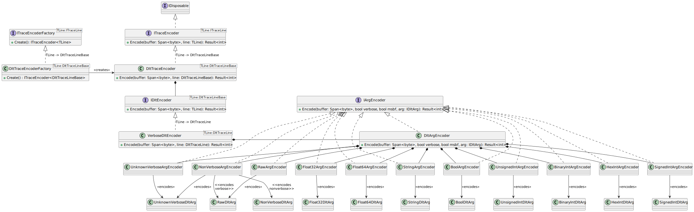

# DLT Writer Design <!-- omit in toc -->

This document considers the mechanism to take a DLT trace line and write this to
a stream that conforms to the DLTv1 protocol. This design is based on DLTv1 from
R20-11 and earlier.

## Table of Contents <!-- omit in toc -->

- [1. DLT Trace Writer](#1-dlt-trace-writer)
  - [1.1. Purpose of the DLT Trace Writer](#11-purpose-of-the-dlt-trace-writer)
  - [1.2. Use Cases of the DLT Trace Writer](#12-use-cases-of-the-dlt-trace-writer)
- [2. Design for the Writer](#2-design-for-the-writer)
  - [2.1. Factory Creation Model](#21-factory-creation-model)
  - [2.2. Format of a DLT v1 Packet](#22-format-of-a-dlt-v1-packet)
  - [2.3. Argument Encoders (DLT Trace Encoder)](#23-argument-encoders-dlt-trace-encoder)
  - [2.4. Control Encoders (DLT Trace Encoder)](#24-control-encoders-dlt-trace-encoder)
  - [2.5. Chain of Object Construction and Extension](#25-chain-of-object-construction-and-extension)
    - [2.5.1. Packet Based Behaviour](#251-packet-based-behaviour)
    - [2.5.2. Extending for a Storage Header](#252-extending-for-a-storage-header)
    - [2.5.3. Writing Non-Verbose](#253-writing-non-verbose)

## 1. DLT Trace Writer

There are three trace writers for DLT. A trace writer prepares a packet and
ensures that a write is done as a single packet.

* TCP based streams, where a DLT packet starts with the standard header.
* Storage files, where a header based on the ECU and the recorded time stamp is
  recorded.
* Serial based streams.

### 1.1. Purpose of the DLT Trace Writer

The DLT Trace writer shall write DLT verbose messages based on trace lines. Data
can be sent out via any stream, to a file or a network. Data is sent out as
packets to the stream interfaces.

### 1.2. Use Cases of the DLT Trace Writer

The following use cases are considered:

* Take a decoded trace line (verbose or non-verbose) and write, where possible,
  as a verbose message.
* Data will be taken from the trace line and serialized to a temporary buffer,
  which is then written. The buffer is fixed, up to 64kB. A trace line would
  result in a single write call to the stream.
* Arguments as provided by the DLT Trace Decoeder should be supported.
* It should be possible to extend functionality based on custom arguments.

## 2. Design for the Writer

### 2.1. Factory Creation Model

The design for the writer will use factories, which implement interfaces,
following a similar pattern to [DLT Decoder Design](./DLT.DecoderDesign.md).

This will allow a common implementation for writing DLT packets, which can be
extended to prepend appropriate headers. The encoder would be the same for all
the various writers:

* Network Writer (no headers)
* File Writer (with a storage header)
* Serial Writer (with a serial header)

and this is independent of how to write the individual packets, which parses the
trace line, and the arguments in the trace line to serialize the data.

A different DLT encoder factory can be provided to a Dlt writer factory,
especially if the user wishes to extend an encoder for their own types.

### 2.2. Format of a DLT v1 Packet

The data that will be written in this design is limited only to writing DLT
verbose. This implies the DLT non-verbose flag will be ignored. This is useful
for converting non-verbose messages to verbose messages that can be read offline
without needing the original FIBEX conversion file.

### 2.3. Argument Encoders (DLT Trace Encoder)

The encoder is responsible for writing the data.

This can be extended to handle further argument types, e.g. from a Non-Verbose
message that can't be decoded to a RAW argument.

### 2.4. Control Encoders (DLT Trace Encoder)

TBD

### 2.5. Chain of Object Construction and Extension

The `DltTraceWriterFactory` has a `DltTraceEncoderFactory`. The writer factory
returns an object, such as `DltTraceWriter` which knows how to write a verbose
message by using the `DltTraceEncoder`. The main purpose of the `ITraceWriter`
is to write to a `Stream`.

The `DltTraceEncoder` knows how to write a complete line to a buffer as a single
packet (not a stream). It writes the standard header based on the features in
the line. An extended header is written as needed, followed by the following
arguments. For this implementation, the non-verbose flag is ignored lines are
written as verbose.

The `VerboseDltEncoder` is a high level class that takes a list of `IDltArg`
objects, and writes them all to the given buffer with verbose type info.

The `DltArgEncoder` is intended to take an argument type and write it in either
verbose, or non-verbose mode, for any type of supported `IDltArg` type.

Note: To write non-verbose, the `DltTraceEncoder` would need to write to a
`NonVerboseDltEncoder`, and it chooses to write verbose or non-verbose to the
`DltArgEncoder`. An extension to the `StringDltArg` would be needed to
differentiate between a dynamic string and a static string, and the
`DltArgEncoder` would need modifications to ignore writing static strings.

#### 2.5.1. Packet Based Behaviour

It is desirable that the complete message is constructed using the
`IDltTraceEncoder` before sending it out on the network. This allows underlying
streams to know upfront the complete packet size before sending out, potentially
allowing for fragmentation if needed.

#### 2.5.2. Extending for a Storage Header

A `DltFileTraceWriterFactory` would create a `DltTraceWriter` but use a
`DltFileTraceEncoder`, which prepends every buffer by 16 bytes containing the
storage header.

Writing data with a serial header is also trivial.

Having the same `DltTraceWriter` means that the encoder is responsible for
writing the headers as well. This allows having to write only a single class
handling output to streams or other formats (e.g. network packets that are not
stream based), including asynchronous I/O, while the format is delegated to the
actual encoder to write to the buffer before it is sent out.

#### 2.5.3. Writing Non-Verbose

This version does not support writing non-verbose messages as without
functionality to write a FIBEX file, reading the file afterwards is undefined.

However, the `DltArgEncoder` already knows how to write payloads without a type
info, so it would require implementing a `NonVerboseDltEncoder` which tells the
`DltArgEncoder` to write non-verbose. There should be an appropriate
`DltNvTraceEncoder` that would write the message identifier in addition before
writing the data.
