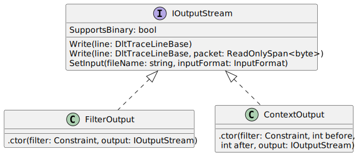

# Design and UML for DltDump <!-- omit in toc -->

This document tries to organize the [Design Requirements](designrequirements.md)
for construction of the software (identify the components and features for
implementation in an incremental manner).

- [1. Application Use Cases](#1-application-use-cases)
  - [1.1. Search Flow Model](#11-search-flow-model)
- [2. Layered Design](#2-layered-design)
  - [2.1. Overview of the Layers](#21-overview-of-the-layers)
    - [2.1.1. Root](#211-root)
    - [2.1.2. View](#212-view)
    - [2.1.3. Application](#213-application)
    - [2.1.4. Services](#214-services)
    - [2.1.5. Domain Model](#215-domain-model)
    - [2.1.6. Infrastructure](#216-infrastructure)
    - [2.1.7. Framework](#217-framework)
  - [2.2. View](#22-view)
    - [2.2.1. Command Line Options](#221-command-line-options)
    - [2.2.2. The Command Factory](#222-the-command-factory)
  - [2.3. Application](#23-application)
    - [2.3.1. Help and Version](#231-help-and-version)
    - [2.3.2. Filtering and Output](#232-filtering-and-output)
      - [2.3.2.1. Initialization](#2321-initialization)
      - [2.3.2.2. Instantiating a Stream from the Input Path](#2322-instantiating-a-stream-from-the-input-path)
        - [2.3.2.2.1. Implementing a IInputStreamFactory](#23221-implementing-a-iinputstreamfactory)
      - [2.3.2.3. Decoder Factory](#2323-decoder-factory)
      - [2.3.2.4. The Output Stream, Context and Filter](#2324-the-output-stream-context-and-filter)
  - [2.4. Domain](#24-domain)
    - [2.4.1. InputStreamFactory and InputStream](#241-inputstreamfactory-and-inputstream)
    - [2.4.2. Decoders (and PCAP, PCAPNG formats)](#242-decoders-and-pcap-pcapng-formats)
      - [2.4.2.1. DLT Trace Decoder (AutoSAR PRS format)](#2421-dlt-trace-decoder-autosar-prs-format)
      - [2.4.2.2. DLT Trace Decoder for PCAP and PCAPNG](#2422-dlt-trace-decoder-for-pcap-and-pcapng)
    - [2.4.3. Trace Output](#243-trace-output)
      - [2.4.3.1. Console Output](#2431-console-output)
      - [2.4.3.2. Text File Output](#2432-text-file-output)
      - [2.4.3.3. DLT File Output](#2433-dlt-file-output)
      - [2.4.3.4. File Templates for DLT and Text Output](#2434-file-templates-for-dlt-and-text-output)
      - [2.4.3.5. Input File Concatenation](#2435-input-file-concatenation)
      - [2.4.3.6. Splitting Output Files](#2436-splitting-output-files)
      - [2.4.3.7. Detailed Logic for Splitting and Concatenating Files](#2437-detailed-logic-for-splitting-and-concatenating-files)
      - [2.4.3.8. IOutputStream Object Lifetime](#2438-ioutputstream-object-lifetime)
      - [2.4.3.9. On Flush](#2439-on-flush)
    - [2.4.4. The Filter and the Context](#244-the-filter-and-the-context)
      - [2.4.4.1. Output Chaining](#2441-output-chaining)
      - [2.4.4.2. Context Implementation](#2442-context-implementation)
    - [2.4.5. Decoder Extension on Line Decoding](#245-decoder-extension-on-line-decoding)
      - [2.4.5.1. DltTraceDecoder writing to IOutputStream](#2451-dlttracedecoder-writing-to-ioutputstream)
  - [2.5. Infrastructure](#25-infrastructure)
    - [2.5.1. Version Information](#251-version-information)

## 1. Application Use Cases

The main purpose of this application is to read a file, filter the contents, and
output the contents in the format the user chooses.

### 1.1. Search Flow Model

The following diagram shows the high level flow of how searching through a DLT
file should work.


The user provides one or more input files, which are read as input streams.
These input streams may be files, TCP streams or serial port streams. In the
future, they could be other streams (e.g. HTTP / HTTPS / FTP or UDP packets).

The input stream is given to a decoder. This decoder knows how to read the input
stream. It could be a DLT stream with or without a header (storage or serial
marker), a PCAP or PCAPNG file, or another decoder in the future for different
encapsulation formats. Each input stream is one continuous DLT log.

If the output is written to the console, the DLT decoder provided by
`RJCP.Diagnostics.Log.Decoder.DltTraceDecoder` produces a trace line, where as
when producing a binary file, it must be captured during the decoding phase to
have access to the original packet data.

The history is used if context before or after a filter is required, and outputs
the lines that should be recorded. The filter is used on the decoded trace line
to identify if it should be recorded or not. The Console Output and File Output
both contain the context and filter, which differs essentially in where it is
instantiated and used, rather than the functionality.

The Console output just writes the output to the console.

The binary writer takes a DLT binary packet (captured from the input stream) and
writes it to an output file. The file could be split and named based on various
rules, not modifying the original input stream. The naming of the file may be
known upfront, or only after the first line is written (if the name is based on
the timestamp of the first line for example).

From this simple idea, it is easy to extend the application later to support
compressed files, different container formats, more complex filters. It is an
extensible (even if simple) design.

## 2. Layered Design

The first part contains a very quick overview of how the layers are defined. The
second part (consisting most of this section) is a detailed breakdown of the
components within the layers.

### 2.1. Overview of the Layers

The software folder structure should have the following namespaces, with `Root`
being in the root namespace.

 

The layered design is based on the principles of Domain Driven Design by Eric
Evans. It has been extended slightly. A higher layer can access an element in
the lower layer, but not the reverse. There is no strict rule that only the
immediate layer is accessible, so that the application layer might handle a
reference to the infrastructure layer, or the application layer uses elements
from the framework layer.

#### 2.1.1. Root

This is where the program entry points are. It instantiates the View.

#### 2.1.2. View

This is the user interface. This is a command line application, so it gets the
options the user provided and executes the use cases in the application layer.
If a graphical user interface should be created, only this layer is modified.

#### 2.1.3. Application

These are classes that represent various application use cases.

#### 2.1.4. Services

Generally thin classes that offer specific services to the View and the
Application layers. It might depend on the infrastructure or framework. It
usually offers thin functionality that the View or the Application uses.

For the command line, there is a special service, called the `Terminal` which
formats strings to print to the terminal. In a GUI application, a ViewModel
would define the classes that the View binds to, but the application updates.

#### 2.1.5. Domain Model

The Domain Model contains the parts which business logic can combine together to
execute use cases. Elements of the domain model can be:

* Input Streams: Mapping files and URIs to streams
* Decoders: Know how to read the input streams
* Filters: Determine if a line matches a user filter
* Output: Knows how to write the output, either console or binary
* Context: Keeps buffers of lines for showing context on a filter match

Each element of the domain model on its own is independent, and has minimal
input on other elements of the domain model. The Application layer ties the
Domain model together. As the domain becomes larger, application services can be
introduced.

#### 2.1.6. Infrastructure

This contains code local to this application, but could be considered reasonably
generic, but for now only used in this application. Importantly, it doesn't
contain any thing related to policy. It helps implement business logic for the
application, but doesn't assume what those decisions are, applying only
technical constraints.

#### 2.1.7. Framework

This encapsulates reusable library components, abstracting the runtime or the
Operating System.

### 2.2. View

The view is the component that reads the command line and executes the command
as given on the command line. It's purpose is to parse the user input (the user
interface) and instantiate the appropriate application which does the work.

#### 2.2.1. Command Line Options

The command line options are provided by the entry point to the program. Parsing
the command line options to a class is done by the infrastructure component
`RJCP.Core.CommandLine`.


The command line options that are supported are:

Help and Information:

* `-?` or `--help`
* `--version`

Input

* This is just the first non-option argument. It can be a file or a URI which is
  parsed

Writing Output Files used by the Binary Writer.

* `-o` or `--output`: Provides a string that might also contain templates
* `-f` or `--force`: Tells the Binary Writer to overwrite the file if it already
  exists.
* `-s` or `--split`: How large to write each file before splitting.

Console Output

* `--position`: Print the position in the input stream for each packet

Filter Options (within the Filter)

* `-s` or `--string`: Searches the text content of a DLT line for a partial
  match of the string.
* `-r` or `--regex`: Searches the text content of a DLT line for a regular
  expression match, using .NET regular expression rules.
* `-i` or `--ignorecase`
* `--ecuid=A`: Filter for one or more ECU IDs.
* `--appid=A`: Filter for one or more APP IDs.
* `--ctxid=A`: Filter for one or more Context IDs.
* `--session=n`: Filter for one or more Session IDs.
* `--type=T`: Filter for one or more DLT types.
* `--verbose`: Filter for verbose messages only.
* `--control`: Filter for control messages only.
* `--nonverbose`: Filter for non-verbose messages only.

Context Options, affecting how lines are printed before and after a filter
match:

* `-A=n` or `--after-context`: Provide context for `n` lines after the match
* `-B=n` or `--before-context`: Provide context for `n` lines before the match

#### 2.2.2. The Command Factory

The View essentially has two commands from the command line - to print help and
the version, or to filter inputs.

This diagram shows how the command line options are read, and then a factory is
used to create the appropriate command. This can be generated directly from the
options.


If more commands are needed on the command line, the factory can be extended.

### 2.3. Application

#### 2.3.1. Help and Version

To get a simple idea of the minimalistic design to print the version and help
information on the console from the View:


The Help Command retrieves lines of text that it should print, and then formats
and prints these on the command line. The access to the console should only be
from the View.

#### 2.3.2. Filtering and Output

The filter application takes the inputs; and constructs and configures the
objects necessary for:

* sets up a loop if there are more than one input streams
* the input stream abstracted from the input URI
* the decoder, which is told the input format and the input stream
* a filter for a trace line and also maintains context if required
  * The filter portion handles the `--string`, `--regex`, `--ignorecase` if
    filtering strings or regexes, `--ecuid`, `--appid`, `--ctxid`, `--session`,
    `--type`, `--verbose`, `--control`, `--nonverbose` options
  * The context portion is required for `--after-context` or `--before-context`
  * This must be before the binary writer or the console writer.
* a binary writer that can split and rename files as necessary if writing to a
  file
  * handles the `--output`, `--force`, `--split` options
  * it needs input information about the names of files, time stamp information.
    The module for handling the environment data for the application should be
    separate as there are multiple components to update the state, while the
    binary writer needs the state.
    * The input file name being processed. Known by the loop when opening the
      input stream.
    * The counter is internal, but will need to be reset at the end of the loop
    * The date/time is known only after the first line is decoded
  * must be run from within the decoder thread, where the input stream bytes and
    decoding information is available
* a console writer that prints the line to the console
  * handles the `--position` option
  * Is handled after decoded

The next stages describe the following stages:

* The input stage
* The decoder
* The output stage for console writing
* The output stage for file writing

##### 2.3.2.1. Initialization

The View layer handles the user interface and has the list of inputs. It shall
interpret the input commands and construct a `FilterConfig` object which
describes how the `FilterApp` should configure itself. Most of the options from
the command line will be copied to the `FilterConfig` object.


The `FilterApp` initializes all objects it needs from the `Domain` layer.

It will loop over all the inputs given in the `FilterConfig`. The
`InputStreamFactory` knows how to take the input file which is a URI string, and
generates an appropriate stream. This stream could be a file, or a TCP stream.
The output `IInputStream` provides additional methods which can asynchronously
connect the stream if it is required (files don't need to be connected, where
network streams do).

The `IInputStream` provides additional information about how to instantiate a
decoder. It can indicate if the URI is a "live" stream, where time stamps are
generated based on the current system time, or if the time stamp is derived from
the input file. This information is needed when constructing the decoder.

It will also "guess" the input file format based on the URI that was given,
which determines the decoder that should be instantiated.

Because the inputs are looped, each input is decoded one after the other, there
being no multiplexing of input files to generate a single file (e.g. no sorting
of the inputs or their time stamps are considered in this design).

##### 2.3.2.2. Instantiating a Stream from the Input Path

The input path can be a file name or a URI. The diagram in the previous section
is a simplification. To enable testing and extension for reading various input
streams, the following design is taken.

In the diagram below, it shows the `DltFileStreamFactory` and the
`DltFileStream`, but the same is also for the serial and network streams.


The `FilterApp` instantiates only through the `InputStreamFilter`. This has an
internal mapping of a URI scheme to a second factory, e.g.:

* `DltFileStreamFactory`: creates a `DltFileStream`, opening a `FileStream`,
  that is for DLT files with a storage header. The URI is `file://` or just a
  local path. Note, this can extend for different encapsulation formats (e.g.
  for PCAP or PCAPNG files).
* `DltSerialStreamFactory`: creates a `DltSerialStream`, opening a
  `SerialPortStream` (another project of mine), that is for DLT with the the
  `DLS\1` header. The URI starts with `ser:`.
* `DltNetworkStreamFactory`: creates a `DltNetworkStream`, opening a TCP stream
  for streams that have the DLT server. The URI starts with `tcp:`.

Other schemes can be added later, such as `http://`, or `https://` that can use
underlying .NET stream implementations. The decoder just needs a stream and to
know if the timestamps are generated locally, or come from the stream.

###### 2.3.2.2.1. Implementing a IInputStreamFactory

When implementing a new `IInputStreamFactory`:

* Create a new class that implements `IInputStream`.
* Create a new class that implements `IInputStreamFactory`, preferably derived
  instead from `InputStreamFactoryBase`.
* The new factory checks the stream and instantiates the specific
  `IInputStream`.
* Modify the `InputStreamFactory` class to add the scheme and reference the
  newly created factory class.

The sequence of how the `FilterApp` uses the `IInputStreamFactory` is given:


##### 2.3.2.3. Decoder Factory

The decoder factory is an implementation that is told what kind of decoder to
create based on various inputs given by the `FilterConfig` class. The decoder
factory is a domain object as it is one class that can decide which decoder to
create, where as the framework component factory only creates a decoder for a
specific format.

The decoder factory is given the input file format from the `FilterConfig`,
which it has presumably received from the `IInputStream`.

* Checks the type of URI from `IInputStream`
* Creates a decoder based on TCP, Serial, File. Online mode or not.
* Handles PCAP and UDP streams

##### 2.3.2.4. The Output Stream, Context and Filter

The `IOutputStream` is a simple interface that knows how to write the output DLT
line. It has a `Write` methods, one that takes a `DltTraceLineBase` and
optionally a `ReadOnlySpan<byte>` which describes the packet.

The various output streams may be one of:

* To the console; or
* To a text file; or
* To a binary file.

The output can be prefixed by another object implementing the `IOutputStream`
which can filter the data, and optionally provide context. This allows the
`FilterApp` to abstract and not care about the output stage, while being
flexible about what and how the data is written. This is the Filter and Context
information.

Text output, that doesn't require the original binary packet, can be written
from the `FilterApp` after getting a line from the decoder.

Output that must write data using binary packets must be run in the thread that
is doing the decoding, i.e. as part of the decoder, because a `DltTraceLineBase`
does not maintain the raw binary data. The decoder must call the `IOutputStream`
to pass the information, and so the `FilterApp` must provide the details to the
decoder factory.

### 2.4. Domain

The domain layer contains logic specific to this application or the problem
domain. It implements the business logic specific to reading and writing DLT
data.

#### 2.4.1. InputStreamFactory and InputStream

This component handles parsing a string input, and determining if this is a file
to read, or a URI for creating a stream.

The output of the `InputStreamFactory` is an object of type `IInputStream` which
returns a stream and other metadata:

* If time stamps are to be obtained from the stream, or from the PC
* If the stream must be "connected", such as a network stream
* The assumed type of stream input

| Input URI            | File Format                       | Connect? | Time Stamp               |
| -------------------- | --------------------------------- | -------- | ------------------------ |
| `file.dlt`           | Storage Header                    | No       | Storage Header from file |
| `file.pcap`          | Wireshark, UDP, no storage header | No       | Wireshark Time stamp     |
| `file.pcapng`        | Wireshark, UDP, no storage header | No       | Wireshark Time stamp     |
| `file://../file.dlt` | Storage Header                    | No       | File                     |
| `ser:..`             | `DLS\1`                           | No       | Local (online mode)      |
| `tcp://...`          | DLT                               | Yes      | Local (online mode)      |

Connecting the stream should be done by the `FilterApp` application in an
asynchronous manner before giving to the decoder.

#### 2.4.2. Decoders (and PCAP, PCAPNG formats)

There are three decoders implemented for reading a stream of bytes and
interpreting DLT contents, implemented as per the [AutoSAR R20-11
PRS](https://www.autosar.org/fileadmin/user_upload/standards/foundation/20-11/AUTOSAR_PRS_LogAndTraceProtocol.pdf)
standard (DLT version 1).

Additional decoders can be implemented dependent on the `IInputStream` assumed
format, that derives from the `DltTraceDecoderBase`. For example, reading a
WireShark file, that contains DLT packets transmitted as UDP.

##### 2.4.2.1. DLT Trace Decoder (AutoSAR PRS format)

If writing to the console, the DLT Trace Decoder used can be instantiated from
the decoders already defined. The output of the decoder is the result of the
decoder `GetLineAsync()` which is then used to apply to a filter and then print
on the console.

If writing to a file, the DLT Trace Decoder must also provide the input buffer
as well as other metadata. The original packet is required so that in case of a
match, that exact buffer can be written to the binary writer.

Further, the input may not have a storage header, and a storage header must be
constructed. Information about the decoded packet is part of the
`IDltLineBuilder` object maintained internally in the decoder and must also be
made present to the binary writer.

##### 2.4.2.2. DLT Trace Decoder for PCAP and PCAPNG

A new DLT Trace Decoder must be written that derives from the existing decoder.
In particular, when the PCAP decoder receives data to decode, it must first
unwrap the PCAP packet data. It is not responsible for decoding the DLT data,
and calls the base decoder to generate the packet data.

The precise specifications may change, but the first version should decode:

* PCAP and PCAPNG formats
* An integral number of packets stored in a UDP frame with destination port
  3490, where there is no fragmentation
* Optionally support 802.1q VLAN

Notably what will not be supported in this first version will be

* Fragmented UDP packets
* 802.1q double tagging
* Additional filtering based on PCAP

#### 2.4.3. Trace Output

There are multiple output sinks, each shall also implement the `IOutputStream`.
The sinks are:

* The console; or
* A text file (UTF8); or
* A binary DLT output

It shall be easy to extend with further sinks. A diagram of how the
`IOutputStream` object is to be created:


A mapping of the `OutputFormat` to the object:

| OutputFormat | Output Object    | Supports Binary |
| ------------ | ---------------- | --------------- |
| `Console`    | Console Output   | False           |
| `Text`       | Text File Output | False           |
| `Dlt`        | Dlt File Output  | True            |

If `OutputFormat.Automatic` is chosen, it should choose the output object based
on the output file name:

* `null` reference, `CON:` or `/dev/stdout`: Console Output
* `*.dlt`: DLT File Output
* Any other file name: Text File Output

##### 2.4.3.1. Console Output

This class knows only how to output the DLT trace line to the console. The
construction of this object must know if the position should be printed or not.

##### 2.4.3.2. Text File Output

For consistent output to a text file in UTF8 format, it is possible to write to
a text file output. When using shell redirection on Windows Power Shell, the
output is written as UCS2 and can generate large files. The same program used on
the Windows Command Shell prints output using the current code page. As such,
console output can provide inconsistent results.

The construction of this object must know if the position should be printed or
not.

It must maintain a text stream, the file name of the output, automatically split
the output on each line as required by the inputs.

##### 2.4.3.3. DLT File Output

The DLT file output writer implements both methods for writing data, one only
containing the DLT line, the other containing the DLT line with the binary
packet data.

If the binary packet data is not available, it must construct the packet and
write the data. It can be limited so that it only writes strings and signed
integers to the output. It may limit itself to first converting the payload to a
single string and writing this. This is typically used to write skipped data
that was not part of the original input.

If the binary packet data is available, it shall write this. The input data may,
or may not contain a storage header. If the storage header is missing, one shall
be constructed and written.

This output writer also maintains a binary stream, the file name based on a
template, the size of the output stream on when to split.

##### 2.4.3.4. File Templates for DLT and Text Output

The functionality for writing DLT and text files have components in common and
should be implemented in the `OutputBase`:

* Mapping the input template to an output file name
  * `%FILE%`. Knowing the name of the input file. This is only known by the
    application layer. The output writer must be told of the input file name
    before a new file is written.
  * `%CDATE%`, `%CTIME%`, `%CDATETIME%`. Take the timestamp from the
    `DltTraceLineBase` message if this is the first line to write. This implies
    delayed opening of the file if it contains one of these elements in the
    output template.
  * `%CTR%`. The counter for the number of files written can be handled by the
    writer itself.
* The size when splitting the output must be communicated from the `FilterApp`
  application.
* If it should append to the file if it exists, or create a new file (i.e the
  first input would require a new file, subsequent would append if the output
  file name does not change)
* If it should overwrite the file or raise an error (dependent on the `--force`
  flag).

On initialization, the `OutputStreamFactory` instantiates a `IOutputStream`. For
the `DltOutput` and `TextOutput`, it gives also the `Split` and `Force`
properties which are used to initialize the base object `OutputBase`. The
`IOutputStream` object is alive for all inputs. This allows the ability to
effectively concatenate files if the output template file name suggests so.

When the `FilterApp` opens a file for reading, it tells the `IOutputStream` of a
potentially new file to write through `SetInput`. The `InputFormat` is used so
the `IOutputStream` knows how to write the header and the packet if needed.

The `OutputBase` is responsible for parsing the file name as a template. It gets
the `%FILE%` from `SetInput`, the `%CDATE%`, `%CTIME%` and `%CDATETIME%` from
the first `Write` just before opening the file. The `%CTR%` is maintained
internally.

##### 2.4.3.5. Input File Concatenation

Input files shall be concatenated if the output file name is independent of the
input file name. All inputs will be processed one after the other, and split as
necessary.

That means, if the template does not contain anything that is dependent on the
input file name, then concatenation is allowed. Otherwise, it is expected for
every input, there is a separate output file.

Rule: `AllowConcatenation = !%FILE%`

##### 2.4.3.6. Splitting Output Files

If the `Split` option is provided so that files should be split, then files will
be split and dependent on the variables `%CTR%` and `%CDATETIME%`, `%CDATE%`,
`%CTIME%`. If after a split the file name has not changed (say for example, it's
based on the time stamp which hasn't changed), the current file will still be
written to. Using the `%CTR%` ensures that the file will be split.

If the template doesn't contain any variable that is expected to change as a
file is parsed, then splitting is unnecessary. That is, it must have one of the
above mentioned variables.

Rule: `AllowSplit = %CTR% || %CDATE% || %CTIME% || %CDATETIME%`

##### 2.4.3.7. Detailed Logic for Splitting and Concatenating Files

To handle the logic of input files being converted to output files, it is split
into two logical paths, depending on `AllowConcatenation`. For the current
output, instead of considering it a single file, we consider a list of Segments,
which are a list of files written to the output, which when considered together,
is the output stream. If `AllowConcatenation` is `true`, there is only one
output stream (so one list of Segments), otherwise, a list of Segments per
input.

The following table summarizes the above sections

| %FILE% | %CTR% | %CDATETIME% | AllowSplit | AllowConcat | Example                                                                      |
| ------ | ----- | ----------- | ---------- | ----------- | ---------------------------------------------------------------------------- |
| N      | N     | N           | N          | Y           | f1.dlt, f2.dlt => out.txt                                                    |
| N      | Y     | N           | Y          | Y           | f1.dlt, f2.dlt => out_001.txt, out_002.txt, out_003.txt                      |
| N      | Y     | Y           | Y          | Y           | f1.dlt, f2.dlt => out_001_{time}.txt, out_002_{time}.txt, out_003_{time}.txt |
| N      | N     | Y           | Y          | Y           | f1.dlt, f2.dlt => out_{time}.txt, out_{time}.txt, out_{time}.txt             |
| Y      | N     | N           | N          | N           | f1.dlt, f2.dlt => f1.txt, f2.txt                                             |
| Y      | Y     | N           | Y          | N           | f1.dlt, f2.dlt => f1_001.txt, f1_002.txt, f2_001.txt                         |
| Y      | Y     | Y           | Y          | N           | f1.dlt, f2.dlt => f1_001_{time}.txt, f1_002_{time}.txt, f2_001_{time}.txt    |
| Y      | N     | Y           | Y          | N           | f1.dlt, f2.dlt => f1_{time}.txt, f1_{time}.txt, f2_{time}.txt                |

The following logic applies to satisfy the rules above:

* `OutputBase.SetInput(input: string)`:
  * If `!AllowConcatenation`:
    * Closes the current file.
    * Sets the Segments list to `null`.
  * If `AllowConcatenation`, then the file isn't closed as we join the inputs
    together.
  * Updates the variable `%FILE%` based on the new input file name.
  * The file format is used by only `DltOutput`.
* `OutputBase.Write()`:
  * If `!OutputWriter.IsOpen()`:
    * This is a new file, or was closed because the last split was too large.
    * Set the time stamp variables `%CDATETIME%`, `%CDATE%`, `%CTIME%`.
    * Open a new file (or append an existing) with OutputWriter (see below).
  * Write the line (in text or binary form).
  * If `SplitAllowed`, and the file length > split size:
    * Close the file
    * Increment `%CTR%`

The logic in getting the output file name and mode and about to open a new file,
which is handled by `OutputBase` to be common for any `IOutputStream` that
writes files.

* If the Segments list is `null`, this is the first line we're writing (for this
  input):
  * `%CTR%` is set to `001`.
  * Generate the file name from the template.
    * If we've created this file before, even for a different input, then we
      raise an error.
    * If the file is in the list of inputs, then generate an error.
  * Create a new Segments list, add this file name.
  * `FileMode = Force ? CreateNew : Create`
* If the Segments list is not `null`, then we closed the file due to split size
  (but not due to a new input file):
  * Generate the file name from the template. The `%CTR%` has already been
    incremented.
    * If we've created this file before, and it's not the same as the last file
      in the Segments list, then we raise an error (which would otherwise result
      in data converted being destroyed);
      * `FileMode = Append`
    * Otherwise, add to the Segments list.
      * `FileMode = Force ? CreateNew : Create`

##### 2.4.3.8. IOutputStream Object Lifetime

As indicated above, it is important that this object is created once and used
for all input files as in the previous section on concatenating output files.
The `IOutputStream` is then used directly by the `FilterApp` or used by the
decoder. But the `FilterApp` always calls when a new file is processed, between
instantiations of the decoder.

##### 2.4.3.9. On Flush

When the input stream has reached end of file, or the decoder is closed, the
`DltDecoder` has the method `Flush()` called. This should result in the
remaining data in the packet being written to the `IOutputStream`. The
`IOutputStream` must not be `Dispose()`d of, as this would close the underlying
stream, thus causing problems as in the previous section about the object
lifetime.

#### 2.4.4. The Filter and the Context

The filter is used for matching conditions of a trace line, as given by user
input. The context maintains information for when a filter matches, so that
previous lines that didn't match can be printed. They are two separate blocks,
very closely related and to be managed as a single unit.

There are three use cases:

* No filter. Dump all the output lines.
* Filter with no context. Apply the filter and decide stateless if the line
  matches or not.
* Filter with context. If there is a match, context may also need to be logged.

The flow for no context is simple:


The flow with context is slightly complexer and can be used to identify the more
general use case:


For each trace line that is decoded, it is given to the `Context` object if
required. The `Context` object maintains:

* A history of lines for the `--before-context` option
* A counter of how many lines should be given for the `--after-context` option

##### 2.4.4.1. Output Chaining

The filter and the context shall implement the `IOutputStream` interface. It
shall have a constructor allowing another `IOutputStream`, which the filter and
the context can write to.

The output from decoding a line is given immediately to an object of type
`IOutputStream`. The Filter and the Context can be implemented so that the check
and filter the input, and if there is a match, outputs to the next
`IOutputStream` object, which is described in the sections earlier.

These classes does not have to be thread safe. It runs in the context of the
application thread for the console output, or in the context of the decoder
thread. The construction of the class defines the array upfront to minimize
impact on the garbage collector.



From this we see that any output stage can be filtered prior, allowing
separation of the output format from the filtering.

The property `SupportsBinary` and the method `SetInput` are a passthrough.

##### 2.4.4.2. Context Implementation

The `Context` class implements checking the filter and notifying of changes. It
must necessarily have copy operations for the duration of the history given by
the `before-context` option.

The `Context` class is expected to be used in the following manner:

```csharp
do {
    line = await decoder.GetLineAsync();
    if (line == null) continue;

    if (context.Check(line)) {
        foreach (DltTraceLineBase beforeLine in context.GetBeforeContext()) {
            WriteLine(beforeLine, m_Config.ShowPosition);
        }
        WriteLine(line, m_Config.ShowPosition);
    } else if (context.IsAfterContext()) {
        WriteLine(line, m_Config.ShowPosition);
    }
} while (line != null);
```

It works by performing a check for each line. If there is a match, given by the
result of `context.Check(line)` being true, the history buffer must be printed.
The method `context.GetBeforeContext()` returns an `IEnumerable` to iterate over
the history. While iterating, no calls to `context.Check()` are allowed, as the
enumerator and the context buffer share the same buffer to avoid copy
operations. If there is no history, the enumerator is empty.

Then the current line must be printed.

On further iteration and new lines, the history buffer is not updated, while
`context.IsAfterContext()` is true, which also decrements the internal counter
for how many lines should be printed.

#### 2.4.5. Decoder Extension on Line Decoding

The property `IOutputStream.SupportsBinary` can be used to determine if the
`IOutputStream` object should be given to a `DltTraceDecoder`, or be parsed by
the `FilterApp`.

##### 2.4.5.1. DltTraceDecoder writing to IOutputStream

While in the use case for console output, the line is given by the result of
`GetLineAsync()`, the ability to write to a file requires knowledge of the DLT
packet that was just decoded if it needs to be written to a file (so that the
binary contents of the packet are not modified when writing).

The `DltTraceDecoderFactory` can be given the `IOutputStream` and use this to
determine if it should instantiate an object from `RJCP.DLL.Log` library, or if
it should instantiate it's own library which derives from `RJCP.DLL.Log` that
uses the `IOutputStream` to write the packet.

The `RJCP.DLL.Log` doesn't write to the packet itself, as this is an extension
to decoding. It only offers the ability through inheritance to extend the
functionality which is to be done by the `DltDump` application.


The `RJCP.DLL.Log` must be extended to support the cases when:

* A valid packet is found, then the decoded line and the binary packet data
  should be written. Because the `FilterApp` instantiates `IOutputStream` and
  also `DltTraceDecoder`, it knows the input format, and can instruct the
  `IOutputStream` to remove headers, or add a storage header without knowledge
  from the decoder itself (the decoder doesn't have to know how to write the
  output).
* Invalid data is found, and skipped data is to be written. In this case, only a
  `DltTraceLineBase` is provided, for which the `IOutputStream` must construct
  the binary data from only the line and write to the output file.

The `IOutputStream` already applies filtering and context management through
chaining described earlier.

### 2.5. Infrastructure

#### 2.5.1. Version Information

This class uses the .NET framework to obtain information about the version of
the assembly. This class is expected to be very small and generic. It will
obtain data from the Assembly Informational Version if available, and then from
the file version.
