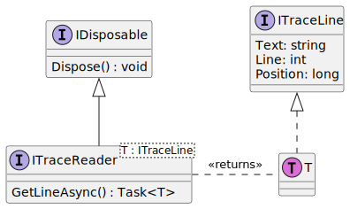
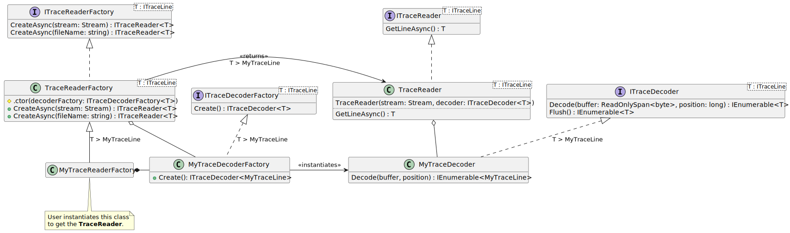

# TraceReader Architecture

The TraceReader project is to read streams and decode the strings converting
them to trace lines. These trace lines are presented to the user as lines of
text with metadata, that the data can be processed in some way.

## The Trace Reader

The user interacts with an object derived from `ITraceReader<T>` to get a new
line from the log stream. The generic type `T` describes the base trace line, so
enumerators can be built on top (without the enumerator necessarily returning an
`ITraceLine` but have the option of providing something more specific in a type
safe way).

Please note, that because the return type is of `Task<T>`, the interfaces cannot
support covariance or contravariance (C# doesn't allow covariance or
contravariance on classes, only interfaces). This is important for the user when
they're constructing the trace readers.

## Instantiating an ITraceReader\<T>

Trace reader factories are expected to be used to obtained objects derived from
`ITraceReader<T>`. In the example below, the user is expected to instantiate the
factory `MyTraceReaderFactory`, which returns the reader that can be used to get
the logging lines. There can be many different factories, one for each
implemented protocol for reading log data.

Factories and Trace readers generally have a lot of common code. For this
purposes, user factories can derive from the base class `TraceReaderFactory<T>`,
and they then only need to provide an implementation on how to instantiate a
`ITraceDecoder<T>`.

Usually, there is one factory for each decoder, and for brevity, a single
factory `MyTraceReaderFactory` is depicted in the above diagram. The
`MyTraceReaderFactory` knows how to instantiate the decoder, `MyTraceDecoder`,
which knows how to decode bytes to generate a collection of type `T` which is
`MyTraceLine`.

The factory knows how to open a file name to obtain a stream. The trace reader
knows how to read the stream and send this to the user decoder.

### Consideration for using Factories

A factory pattern is chosen to instantiate the `ITraceReader<T>`, so that a
clean asynchronous programming pattern can be used (as constructors can not be
used asynchronously and would need to be wrapped).

Factories also allow construction of the `MyTraceDecoder` and related objects to
be better written:

* Each step of construction can be more explicit, allowing for anything more
  than just the simplest types of construction, and easier to read code;
* Automatic detection of input file formats could be part of the factory, and
  factories can be effectively nested.

### The Trace Reader and the Trace Decoder

The `TraceReader<T>` is mostly concerned with reading the stream into an
internal buffer array, and then passing that to the decoder as a `Span<byte>`.
The position of the stream is tracked by the `TraceReader<T>`. The position can
be useful later for decoding errors in the protocol. This happens on the first
call to `GetLineAsync()`.

The `GetLineAsync()` returns a single line. If there is the first time the
method has been called, or all lines have been returned by a previous call, it
reads new data from the stream. This makes the method awaitable, as it reads
from the stream it was given during construction.

It returns `null` in case the stream is closed. Any exceptions are passed on to
the user, but the object itself is not closing the stream or destroying state
from the exception (e.g. if there was a `TimeoutException`, it must be possible
to try again).

The specific decoder `MyTraceDecoder` knows how to decode the bytes in the
`Span<byte>`, and returns a read-only collection of decoded lines. This
collection is then returned by `GetLineAsync()` as mentioned above.

### Performance Considerations

The specific implementation of the `ITraceDecoder<T>` is not intended to be
asynchornous. It blocks until data is decoded. It is given a buffer of data as a
`Span<byte>` and should consider decoding thed ata directly from the span
without copying. Only if an incomplete packet is received, should the decoder
then copy the remaining bytes in teh buffer to its own buffer (which is normally
allocated during construction by the factory, and remains fixed). Then on the
next `Write`, the decoder normally knows how much data is missing, and copies
only the necessary data into its own buffer to decode the packet.

After decoding the packet, it can continue to decode the rest of the data from
the `buffer` parameter in the input (advanced by the number of bytes previously
copied).

If buffering of data is required before reading, this should be done by the
underlying stream. This implementation shall not attempt any buffering itself,
which may necessarily add maintenance burden for complexity and slow down the
decoding process (due to the increased complexity and likelihood of adding extra
threads and context switching associated with being blocked on buffered data).
Let the application decide best for itself how to capture data.

### Covariance of ITraceLine

Covariance is not supported on the interfaces, as the interfaces have methods
that return concrete types of `Task<T>`. Thus, C# doesn't allow covariance or
contravariance.

Implementations that need covariance on the return type `ITraceLine` must do
this explicitly.
