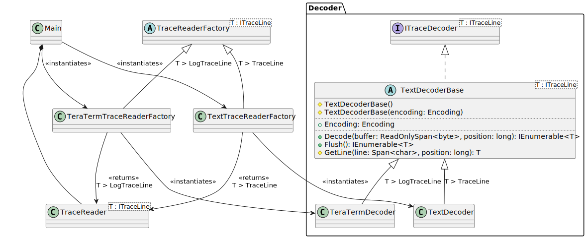

# TraceReader Text File Reading

There are two factories that are provided to allow reading of text files. They
interpret text line formats automatically ending in Unix, Windows or MacOS
Classic.

The `TextTraceReaderFactory` can be used to read text files. The
`TeraTermTraceReaderFactory` can be used to read log files that have time stamps
at the beginning of each line which are written in the format from the
[Terminal](https://ttssh2.osdn.jp/index.html.en) software TeraTerm.

## Reading Text Files

The simplest way to read text files is to instantiate the
`TextTraceReaderFactory` and create a new reader:

```csharp
using (ITraceReader<TraceLine> reader =
  await new TextTraceReaderFactory().CreateAsync(path)) {
    // ... use reader.GetLineAsync() to read each line
}
```

### Encoding used for Reading

The default encoding is UTF8. If a different encoding should be used, set the
factory `Encoding` parameter before instantiating the object.

```csharp
var instance = CodePagesEncodingProvider.Instance;
Encoding.RegisterProvider(instance);

ITraceReaderFactory<TraceLine> factory = new TextTraceReaderFactory() {
    Encoding = Encoding.GetEncoding("iso-8859-15");
};

using (ITraceReader<TraceLine> reader = await factory.CreateAsync(path)) {
    // ... use reader.GetLineAsync() to read each line in iso-8859-15 format
}
```

## Reading Text Files from TeraTerm

Logging projects may use TeraTerm to log serial and console data. TeraTerm has
an option to prepend lines with a time stamp. The `TeraTermTraceReaderFactory`
creates a reader that can interpret these time stamps and provide the meta
information as part of the trace line data.

```csharp
string path = GetFileName();
using (ITraceReader<LogTraceLine> reader = await new TeraTermTraceReaderFactory().CreateAsync(path)) {
    // ... use reader.GetLineAsync() to read each line
}
```

The reader from `TeraTermTraceReaderFactory` returns lines of type
`LogTraceLine`, which contain additionally a `DateTime` field which is the time
stamp at the beginning of each line. The default time stamp is 1/Jan/1970 local
time. All time stamps are returned as local time.

### Encoding used for Reading TeraTerm Files

The encoding property is the same as for the `TextTraceReaderFactory`. Provide
the encoding property to the factory, before calling `CreateAsync()`.

## Class Design

The following diagram contains the class design. By creating a new factory and
deriving from `Decoder.TextDecoderBase` it is easy to provide your own decoders
that can interpret lines of particular formats.



The sequences and relationships for using `TextDecoder` is the same as for
`TeraTermDecoder`. The `Main` class (your code):

* Instantiates the factory
* The factory instantiates the `TraceReader` with the appropriate
  `TextDecoderBase` object when `CreateAsync` is called.
* The factory returns the `TraceReader` object to the user.
